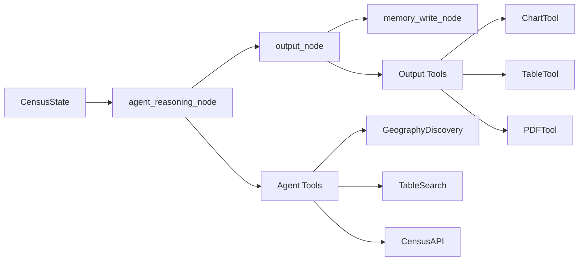

# Census Tool Architecture

**Date**: October 17, 2025  
**Status**: Implementation Guide for Agent-First Architecture  
**Purpose**: Single source of truth for rebuilding broken deterministic graph into working agent system

---

## 1. Executive Summary

### Problem Statement
Current system has **0/3 test queries passing**. The deterministic graph architecture fails on complex Census queries with errors like "Best candidate score below threshold".

### Solution
**Agent-first architecture** with multi-step reasoning using tools. Census API complexity requires dynamic reasoning, not hardcoded pipelines.

### Key Insight
Census API has 144+ geography patterns with hierarchical dependencies, requiring:
- Dynamic geography enumeration
- Table-geography compatibility validation  
- Multi-step reasoning through complex queries

**Reference**: `PHASE9-Census-API-Flexibility-Analysis.md` sections 100-179 for detailed problem analysis.

---

## 2. Current State Analysis

### What Works
- Individual LLM calls (intent parsing, geography resolution, category detection)
- Unit tests for isolated functions
- Graph infrastructure (LangGraph framework)

### What's Broken
- **Overall query execution**: `test_system.py` shows 0/3 queries passing
- **Retrieval scoring**: All queries fail with "Best candidate score below threshold"
- **Agent integration**: `CensusQueryAgent` exists but never called by main.py
- **Architecture mismatch**: Built deterministic graph when agent was specified

### Evidence
```bash
# Current system test results
uv run python test_system.py
# Output: Successful: 0/3, Failed: 3/3, CRITICAL: All tests failed
```

---

## 3. Target Architecture

### 3.1 Design Principle

```
User Question → Agent Reasons (multi-step) → Tools Execute → Agent Validates → Output Tools → Result
```

**NOT**: `User Question → Node1 → Node2 → Node3 → Done` (current broken approach)

### 3.2 Simplified Graph

**Current**: 8 nodes with complex routing
```python
# OLD: Complex branching graph
memory_load → intent → router → {geo, clarify, not_census} → retrieve → plan → data → answer → memory_write
```

**Target**: 4 nodes with linear flow
```python
# NEW: Simple linear graph
memory_load → agent → output → memory_write
```

**Removed nodes**: `intent`, `geo`, `retrieve`, `plan`, `data`, `answer`, `router`, `clarify` (all replaced by agent)

### 3.3 State Flow



---

## 4. Component Specifications

### 4.1 Agent Design (CensusQueryAgent)

**Location**: `src/utils/agents/census_query_agent.py`

#### Current Issues to Fix
- Tool bugs: `GeographyRegistry.resolve()` method missing
- Not integrated into main.py graph
- Agent executor crashes on tool calls

#### Specification
```python
class CensusQueryAgent:
    tools = [
        GeographyDiscoveryTool,      # Find areas/levels
        TableSearchTool,             # Search ChromaDB
        AreaResolutionTool,          # Resolve names to FIPS
        PatternBuilderTool,          # Build Census URL patterns
        TableValidationTool,         # Check compatibility
        CensusAPITool                # NEW: Fetch data
    ]
    
    def solve(self, user_query: str, user_profile: Dict) -> Dict:
        # Returns structured output with:
        # - census_data: Retrieved data
        # - reasoning_trace: Agent's thought process
        # - charts_needed: Chart specifications
        # - tables_needed: Table specifications  
        # - answer_text: Natural language answer
```

#### Agent Prompt Template
```python
AGENT_PROMPT_TEMPLATE = """
You are a Census data expert helping users query the Census API.

REASONING PROCESS:
1. Understand what the user wants
2. Use geography_discovery to find areas/levels
3. Use table_search to find relevant tables
4. Use table_validation to check compatibility
5. Use census_api_call to fetch data
6. Decide if charts or tables are needed
7. Return structured output

Available tools: {tools}

Use ReAct format:
Thought: [reason about what to do next]
Action: [tool name]
Action Input: [tool input as JSON]
Observation: [tool result]
... (repeat until you have the answer)

Final Answer: Return JSON with:
{{
    "census_data": {{...}},
    "data_summary": "...",
    "reasoning_trace": "...",
    "charts_needed": [
        {{"type": "bar", "x_axis": "geography", "y_axis": "population", "title": "..."}}
    ],
    "tables_needed": [
        {{"format": "csv", "columns": [...], "sort_by": "..."}}
    ],
    "answer_text": "Natural language answer"
}}

Question: {input}
{agent_scratchpad}
"""
```

### 4.2 Tool Catalog

#### Reasoning Tools (Census-specific)

**1. GeographyDiscoveryTool** (EXISTS, NEEDS FIX)
- **Purpose**: Enumerate areas, discover geography levels
- **Fix needed**: Add `resolve()` method or update tool to use `find_area_code()`
- **Test**: "List all counties in California" should return 58 counties

**2. TableSearchTool** (EXISTS, WORKING)
- **Purpose**: Search ChromaDB for relevant Census tables
- **No changes needed**

**3. AreaResolutionTool** (EXISTS, NEEDS FIX)
- **Purpose**: Resolve "California" → FIPS code "06"
- **Fix needed**: Point to correct GeographyRegistry method
- **Test**: `resolve("California", "state")` → "06"

**4. PatternBuilderTool** (EXISTS, VERIFY)
- **Purpose**: Construct Census API URL patterns
- **Verify**: Handles enumeration patterns correctly

**5. TableValidationTool** (EXISTS, VERIFY)
- **Purpose**: Check if table supports requested geography
- **Verify**: Queries geography.html correctly

**6. CensusAPITool** (NEW - CREATE)
- **Purpose**: Execute Census API call, return data
- **Implementation**:
```python
class CensusAPITool(BaseTool):
    name = "census_api_call"
    description = "Execute Census API query and fetch data"
    
    def _run(self, query_spec: Dict) -> Dict:
        from src.utils.census_api_utils import fetch_census_data
        result = fetch_census_data(
            year=query_spec["year"],
            dataset=query_spec["dataset"],
            variables=query_spec["variables"],
            geo=query_spec["geo"]
        )
        return {
            "data": result,
            "row_count": len(result),
            "columns": list(result[0].keys()) if result else []
        }
```

#### Output Tools (NEW - CREATE)

**7. ChartTool**
- **Purpose**: Generate visualizations (bar, line, map charts)
- **Library**: plotly
- **Implementation**:
```python
class ChartTool(BaseTool):
    name = "create_chart"
    description = "Create data visualizations"
    
    def _run(self, chart_spec: Dict, data: Dict) -> str:
        import plotly.express as px
        # chart_spec: {"type": "bar", "x_axis": "geography", "y_axis": "population"}
        # Returns: "outputs/charts/chart_12345.png"
```

**8. TableTool**
- **Purpose**: Export data as formatted tables (CSV, Excel, HTML)
- **Library**: pandas
- **Implementation**:
```python
class TableTool(BaseTool):
    name = "create_table"
    description = "Export formatted data tables"
    
    def _run(self, table_spec: Dict, data: Dict) -> str:
        import pandas as pd
        df = pd.DataFrame(data)
        # table_spec: {"format": "excel", "columns": [...], "sort_by": "population"}
        # Returns: "outputs/tables/table_12345.xlsx"
```

**9. PDFTool**
- **Purpose**: Generate PDF reports with question, answer, charts, tables
- **Library**: reportlab
- **Implementation**:
```python
class PDFTool(BaseTool):
    name = "generate_pdf_report"
    description = "Create comprehensive PDF report"
    
    def _run(self, report_spec: Dict) -> str:
        from reportlab.pdfgen import canvas
        # report_spec: {"question": "...", "answer": "...", "charts": [...], "tables": [...]}
        # Returns: "outputs/reports/report_12345.pdf"
```

### 4.3 Graph Nodes

#### Node: agent_reasoning_node (NEW)
**Location**: `src/nodes/agent.py`

**Purpose**: Replace intent/geo/retrieve/plan/data nodes with single agent call

```python
def agent_reasoning_node(state: CensusState, config: RunnableConfig) -> Dict[str, Any]:
    """
    Agent reasons through entire Census query workflow
    """
    from src.utils.agents.census_query_agent import CensusQueryAgent
    
    user_question = state.messages[-1]["content"]
    profile = state.profile
    
    agent = CensusQueryAgent()
    result = agent.solve(
        user_query=user_question,
        user_profile=profile
    )
    
    return {
        "artifacts": {
            "census_data": result["census_data"],
            "data_summary": result["data_summary"],
            "reasoning_trace": result["reasoning_trace"]
        },
        "final": {
            "charts_needed": result.get("charts_needed", []),
            "tables_needed": result.get("tables_needed", []),
            "answer_text": result.get("answer_text")
        },
        "logs": [f"agent: completed with {len(result.get('reasoning_trace', ''))} reasoning steps"]
    }
```

#### Node: output_node (NEW)
**Location**: `src/nodes/output.py`

**Purpose**: Execute output tools (charts, tables, PDFs) based on agent specifications

```python
def output_node(state: CensusState, config: RunnableConfig) -> Dict[str, Any]:
    """
    Generate outputs: charts, tables, PDFs
    """
    final = state.final or {}
    artifacts = state.artifacts or {}
    census_data = artifacts.get("census_data", {})
    
    outputs = {}
    
    # Create charts
    if final.get("charts_needed"):
        from src.tools.chart_tool import ChartTool
        chart_tool = ChartTool()
        outputs["charts"] = [
            chart_tool.create(spec, census_data) 
            for spec in final["charts_needed"]
        ]
    
    # Create tables
    if final.get("tables_needed"):
        from src.tools.table_tool import TableTool
        table_tool = TableTool()
        outputs["tables"] = [
            table_tool.create(spec, census_data)
            for spec in final["tables_needed"]
        ]
    
    # Generate PDF if requested
    if state.profile.get("save_pdf"):
        from src.tools.pdf_tool import PDFTool
        pdf_tool = PDFTool()
        outputs["pdf"] = pdf_tool.generate(
            question=state.messages[-1]["content"],
            answer=final.get("answer_text"),
            charts=outputs.get("charts", []),
            tables=outputs.get("tables", []),
            reasoning=artifacts.get("reasoning_trace")
        )
    
    return {
        "final": {**final, "outputs": outputs},
        "logs": [f"output: generated {len(outputs)} output types"]
    }
```

#### Updated: app.py
```python
def create_census_graph():
    workflow = StateGraph(CensusState, reducers=create_reducers())
    
    # Only 4 nodes
    workflow.add_node("memory_load", memory_load_node)
    workflow.add_node("agent", agent_reasoning_node)      # NEW
    workflow.add_node("output", output_node)              # NEW
    workflow.add_node("memory_write", memory_write_node)
    
    # Linear flow
    workflow.set_entry_point("memory_load")
    workflow.add_edge("memory_load", "agent")
    workflow.add_edge("agent", "output")
    workflow.add_edge("output", "memory_write")
    workflow.add_edge("memory_write", "__end__")
    
    return workflow.compile(checkpointer=SqliteSaver(...))
```

### 4.4 State Management

**CensusState Updates**:
No changes needed to Pydantic model, but usage changes:

- `intent`, `geo`, `candidates`, `plan` fields: Set by agent internally (not separate nodes)
- `artifacts`: Stores agent's census_data and reasoning_trace
- `final`: Stores agent's answer_text and output specifications

---

## 5. Migration Plan

### Phase 1: Fix Existing Agent (2-3 hours)

#### Step 1.1: Fix GeographyRegistry
**File**: `src/utils/geography_registry.py`

**Problem**: AreaResolutionTool calls `registry.resolve()` which doesn't exist

**Solution**: Update AreaResolutionTool to call `find_area_code()` directly
```python
# src/tools/area_resolution_tool.py
def _run(self, name: str, geography_type: str = "state"):
    registry = GeographyRegistry()
    # Change from: registry.resolve(name, geography_type)
    # To: registry.find_area_code(geography_type, name)
    return registry.find_area_code(geography_type, name)
```

#### Step 1.2: Fix GeographyDiscoveryTool
**File**: `src/tools/geography_discovery_tool.py`

**Problem**: Uses `self.registry` but never initializes it

**Solution**:
```python
def _run(self, action: str, dataset: str = None, level: str = None, parent: str = None):
    registry = GeographyRegistry()  # Create instance
    
    if action == "enumerate_areas":
        return registry.enumerate_areas(dataset, level, parent)
    # ... rest of implementation
```

#### Step 1.3: Add CensusAPITool
**Create**: `src/tools/census_api_tool.py`

Wrap existing `fetch_census_data()` function as specified in section 4.2

#### Step 1.4: Update CensusQueryAgent
**File**: `src/utils/agents/census_query_agent.py`

Add CensusAPITool to tools list:
```python
from src.tools.census_api_tool import CensusAPITool

self.tools = [
    GeographyDiscoveryTool(),
    TableSearchTool(),
    AreaResolutionTool(),
    PatternBuilderTool(),
    TableValidationTool(),
    CensusAPITool(),  # NEW
]
```

#### Step 1.5: Test Agent Standalone
```bash
uv run python src/utils/agents/test_query_agent.py
```

**Acceptance**: Completes without AttributeError, returns structured data

### Phase 2: Integrate Agent into Graph (3-4 hours)

#### Step 2.1: Create agent_reasoning_node
**Create**: `src/nodes/agent.py`

Implement as specified in section 4.3

#### Step 2.2: Update app.py
**File**: `app.py`

**Changes**:
- Remove nodes: intent, router, clarify, geo, retrieve, plan, data, answer, not_census
- Add nodes: agent, output
- Simplify edges (linear flow)
- Remove routing.py conditional logic

#### Step 2.3: Update routing.py or delete
**File**: `src/state/routing.py`

**Option**: Delete file (no longer needed with linear flow)

#### Step 2.4: Test from main.py
```bash
uv run python test_system.py
```

**Acceptance**: 3/3 queries pass (NYC, New York City, Chicago all return correct data)

### Phase 3: Add Output Tools (4-5 hours)

#### Step 3.1: Create ChartTool
**Create**: `src/tools/chart_tool.py`
**Dependencies**: plotly, kaleido

#### Step 3.2: Create TableTool
**Create**: `src/tools/table_tool.py`
**Dependencies**: pandas (already installed), openpyxl (already installed)

#### Step 3.3: Create PDFTool
**Create**: `src/tools/pdf_tool.py`
**Dependencies**: reportlab

#### Step 3.4: Create output_node
**Create**: `src/nodes/output.py`

Implement as specified in section 4.3

#### Step 3.5: Update app.py
Add output_node to graph (already in Phase 2 plan)

#### Step 3.6: Update agent prompt
**File**: `src/llm/config.py`

Update AGENT_PROMPT_TEMPLATE to include:
- Instructions for specifying charts_needed
- Instructions for specifying tables_needed
- Example output format

#### Step 3.7: Create outputs directories
```bash
mkdir -p outputs/charts
mkdir -p outputs/tables
mkdir -p outputs/reports
```

#### Step 3.8: Test output generation
**Test query**: "Compare population by county in California and create a bar chart"

**Acceptance**:
- Agent fetches data
- Chart PNG created in outputs/charts/
- Table CSV created in outputs/tables/ (if requested)

### Phase 4: Update Documentation (1 hour)

#### Step 4.1: Mark old docs as deprecated
Add to top of these files:
- `app_description/LLM-Implementation_Phase3.md`
- `app_description/census_app.md`
- `app_description/ARCHITECTURE-REMEDIATION-ROADMAP.md`

```markdown
> **DEPRECATED**: This document describes the old deterministic graph architecture.
> See ARCHITECTURE.md for current agent-first implementation.
```

#### Step 4.2: Update README.md
Reference ARCHITECTURE.md as main technical doc

---

## 6. Integration & Testing

### 6.1 Unit Tests (Maintain Existing)

**Keep and update**:
- `app_test_scripts/test_intent.py` - Remove (intent now internal to agent)
- `app_test_scripts/test_geo.py` - Remove (geo now internal to agent)
- `app_test_scripts/test_retrieve.py` - Remove (retrieve now internal to agent)
- `app_test_scripts/test_data.py` - Update to test agent output format

**Create new**:
- `app_test_scripts/test_agent_tools.py` - Test each tool independently

### 6.2 Integration Tests

#### test_system.py (Update existing)

**Test cases**:
```python
1. "What is the population of NYC?" 
   - Expected: ~8.3M, no error
   
2. "What is the population of New York City?"
   - Expected: ~8.3M, no error
   
3. "Show me population data for Chicago"
   - Expected: ~2.7M, no error
   
4. "Compare population by county in California"
   - Expected: 58 counties enumerated, data for each
   - Expected: Agent reasoning trace shows enumeration
   
5. "Show population trends for NYC from 2015 to 2020"
   - Expected: Time series data with 6 data points (one per year)
   - Expected: Line chart generated automatically
   - Expected: Agent makes 6 separate census_api_call invocations
   - Expected: Data restructured as [["Year", "Population"], ["2015", "..."], ["2016", "..."], ...]
   - Expected: If save_pdf=True, PDF generated
```

**Acceptance Criteria**:
- ALL queries return correct data (not Chicago for NYC)
- No "Best candidate score below threshold" errors
- Agent reasoning trace visible in logs
- 100% success rate (5/5)

### 6.3 Output Tool Tests

#### test_output_tools.py (New)

**Test cases**:
```python
1. test_chart_generation()
   - Input: Census data + chart_spec
   - Output: PNG file exists, valid image
   
2. test_table_export()
   - Input: Census data + table_spec
   - Output: CSV/Excel file exists, data matches
   
3. test_pdf_report()
   - Input: Full report_spec
   - Output: PDF exists, contains question, answer, embedded chart
```

### 6.4 Agent Reasoning Tests

#### test_agent_reasoning.py (New)

**Test cases**:
```python
1. test_geography_enumeration()
   - Query: "counties in California"
   - Verify: Agent uses GeographyDiscoveryTool
   - Verify: Reasoning trace shows enumeration decision
   
2. test_table_validation()
   - Query: "population by census tract"
   - Verify: Agent checks table supports tract level
   - Verify: Reasoning shows validation step
   
3. test_error_recovery()
   - Query with ambiguous geography
   - Verify: Agent uses AreaResolutionTool to clarify
   - Verify: Agent retries with corrected input
```

### 6.5 End-to-End Validation Commands

```bash
# Step 1: Test agent standalone
uv run python src/utils/agents/test_query_agent.py
# Acceptance: No errors, returns structured output

# Step 2: Test system integration
uv run python test_system.py
# Acceptance: 5/5 queries pass

# Step 3: Test output generation
uv run python -c "
from src.tools.chart_tool import ChartTool
from src.tools.pdf_tool import PDFTool
# ... test output creation
"
# Acceptance: Files created in outputs/

# Step 4: Run all unit tests
uv run pytest app_test_scripts/ -v
# Acceptance: All tests pass

# Step 5: Interactive test from main.py
uv run python main.py
# Enter test query, verify correct response
```

---

## 7. Dependencies & Setup

### 7.1 Add to pyproject.toml
```toml
dependencies = [
    ...existing...,
    "plotly>=6.3.0",       # For interactive charts
    "kaleido>=0.2.1",      # For plotly static image export
    "reportlab>=4.0.0",    # For PDF generation
]
```

### 7.2 Install Dependencies
```bash
uv sync
```

### 7.3 Directory Structure
```
census_tool/
├── src/
│   ├── nodes/
│   │   ├── agent.py          # NEW
│   │   ├── output.py         # NEW
│   │   ├── memory.py         # KEEP
│   │   ├── intent.py         # DEPRECATE
│   │   ├── geo.py            # DEPRECATE
│   │   ├── retrieve.py       # DEPRECATE
│   ├── tools/
│   │   ├── census_api_tool.py       # NEW
│   │   ├── chart_tool.py            # NEW
│   │   ├── table_tool.py            # NEW
│   │   ├── pdf_tool.py              # NEW
│   │   ├── geography_discovery_tool.py  # FIX
│   │   ├── area_resolution_tool.py      # FIX
│   ├── utils/
│   │   ├── agents/
│   │   │   ├── census_query_agent.py  # UPDATE
│   ├── state/
│   │   ├── routing.py        # DELETE (optional)
├── outputs/
│   ├── charts/               # NEW
│   ├── tables/               # NEW
│   ├── reports/              # NEW
├── app.py                    # UPDATE
├── main.py                   # NO CHANGES
```

---

## 8. References

### For Implementation
- **This document (ARCHITECTURE.md)** is self-contained

### For Context
- **PHASE9-Census-API-Flexibility-Analysis.md**: Deep dive into why Census API requires agent architecture (sections 100-179)
- **AGENT-IMPLEMENTATION-ROADMAP.md**: Original tool designs and agent specifications (reference but this doc supersedes it)

### Key Sections to Reference
- PHASE9 Lines 108-146: Census API complexity explanation
- AGENT-ROADMAP Lines 22-172: Original tool definitions (updated here with fixes)

---

## 9. Success Metrics

After full implementation:

1. ✅ Agent test passes: `uv run python src/utils/agents/test_query_agent.py` completes successfully
2. ✅ System tests pass: `test_system.py` shows 5/5 queries successful
3. ✅ No wrong data: NYC query returns NYC data (not Chicago)
4. ✅ Reasoning visible: Logs show agent thought process with tool usage
5. ✅ Charts generate: Query with chart request produces valid PNG
6. ✅ Tables export: Query with table request produces valid CSV/Excel
7. ✅ PDFs create: Query with save_pdf=True produces comprehensive report
8. ✅ No threshold errors: Zero "Best candidate score below threshold" messages
9. ✅ Integration complete: main.py → graph → agent → tools → outputs works end-to-end
10. ✅ Documentation accurate: Code matches this specification

---

## 10. Maintenance

### When adding new tools:
1. Create tool in `src/tools/new_tool.py`
2. Add to CensusQueryAgent.tools list
3. Update agent prompt to describe new tool
4. Add tests in `app_test_scripts/test_agent_tools.py`

### When modifying graph:
- Keep it simple: Linear flow preferred
- Test from main.py after any change
- Update this doc if architecture changes

### When debugging:
- Check agent reasoning trace in logs
- Verify tool outputs match expected format
- Test tools independently before testing full agent

---

**This document is the single source of truth for the Census Tool agent-first architecture rebuild. All implementation must follow this specification and guarantee end-to-end integration testing from main.py.**
